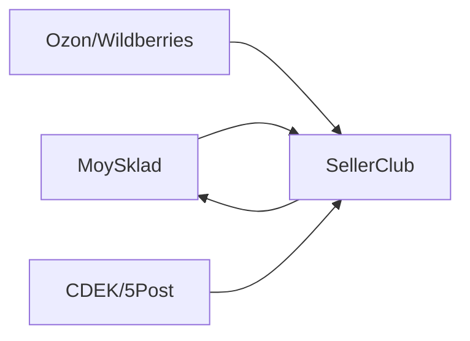

## Overview

SellerClub bridges your MoySklad backend with leading sales platforms like Ozon and Wildberries, plus delivery providers such as CDEK and 5Post. You automate order processing, inventory sync, and shipments without manual intervention, saving hours daily. Focus on growth while SellerClub handles the operational heavy lifting.

## Key Features

SellerClub delivers powerful integrations tailored for e-commerce automation.

<Columns cols={3}>
  <Card title="Sales Platform Sync" icon="shopping-cart" href="#sales-sync">
    Connect Ozon, Wildberries, and more. Orders flow directly into MoySklad, updating stock in real-time.
  </Card>
  <Card title="Delivery Automation" icon="truck" href="#delivery">
    Integrate CDEK, 5Post, and others. Generate labels, track shipments, and sync statuses automatically.
  </Card>
  <Card title="Real-Time Inventory" icon="database" href="#inventory">
    Prevent overselling with bidirectional sync. Stock levels update across all channels instantly.
  </Card>
</Columns>

<Callout kind="success">
  Achieve `<99%` order accuracy and reduce fulfillment time by 70% with SellerClub.
</Callout>

## Quick Start

Get up and running in minutes. Follow these steps to connect your first integration.

<Steps>
  <Step title="Create Account" icon="user-plus">
    Sign up at https://dashboard.sellerclub.com and verify your email.
  </Step>
  <Step title="Connect MoySklad" icon="settings">
    Add your MoySklad API token.

````javascript
// In SellerClub dashboard, enter:
const moySkladConfig = {
  apiKey: `YOUR_MOYSKLAD_API_KEY`,
  organizationId: `your-org-id`
};
````
  </Step>
  <Step title="Add Marketplace" icon="shopping-bag">
    Select Ozon or Wildberries and authorize via OAuth.
  </Step>
  <Step title="Enable Automation" icon="zap">
    Toggle sync rules for orders and inventory. Test with a sample order.
  </Step>
</Steps>

## Next Steps

Dive deeper into SellerClub with these guides.

<Columns cols={2}>
  <Card title="Quickstart Guide" icon="rocket" href="/quickstart">
    Full setup walkthrough with code examples.
  </Card>
  <Card title="Authentication" icon="lock" href="/authentication">
    Secure your API keys and tokens.
  </Card>
  <Card title="Configuration" icon="sliders" href="/configuration">
    Customize integrations for your workflow.
  </Card>
  <Card title="Changelog" icon="git-branch" href="/changelog">
    Stay updated with latest features.
  </Card>
</Columns>

<Expandable title="How does the sync work?" default-open="true">
  SellerClub polls marketplaces every `{5}` minutes and pushes updates to MoySklad via webhooks. View the flow:


</Expandable>

<Callout kind="tip">
  Start with the <a href="/quickstart">Quickstart Guide</a> to automate your first orders today.
</Callout>